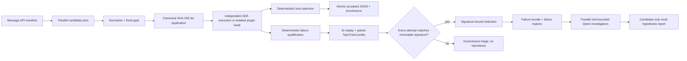

# SGGK Message API Harness Architecture

This document is the architecture source of truth for Qwen3.6-35B-A3B test
authoring, new-API adaptation, SDK execution, and candidate bug localization.

## Non-negotiable boundaries

- Production authoring is Message API only. There is no human-authored,
  clipboard, UI, or checked-in-fixture path that can publish a model output.
- `intranet` and `siliconflow-test` use the same manifest, `message.content`
  JSON contract, fixed gates, execution code, and selection policy. SiliconFlow
  is an explicit protocol simulator, never a fallback endpoint.
- A model response is always an untrusted candidate. Only the host can
  normalize, validate, compile, execute, select, and atomically promote it.
- Model JSON cannot provide commands, executable/runner paths, cwd, environment,
  shell, SDK/link flags, dataset/output paths, URLs, or native tool calls.
- Reasoning text, credentials, and authorization headers are not persisted.



## Parallel authoring and promotion

`run_message_harness_pipeline.py` creates one to eight independent branches.
The intranet default is three candidates; the external SiliconFlow smoke
default is one to control external calls. Candidate roles cycle through:

- `implementation`
- `test_design`
- `adversarial_review`
- `minimal_reproducer`

Generation and fixed gates may overlap. Each unique gate-passing candidate is
executed independently in an isolated artifact directory. Completion order,
latency, token usage, and model self-ratings do not affect selection.
`sggk_candidate_score_v1` uses only host evidence: eligibility, execution,
case/oracle coverage, warnings/repairs, normalized size, and canonical hash.

Selection goals are host-owned:

| Goal | Candidate must prove |
|---|---|
| `fixed_gate_only` | deterministic gate pass |
| `must_pass_execution` | SDK and semantic-oracle pass |
| `must_reproduce_target_signature` | exact target signature plus stable replay |
| `extension_backlog` | valid non-executing extension intake |
| `adapter_build_pass` | isolated new-API compile, registry, schema, smoke, and stable hash pass |
| `auto` | execution pass when `--execute` is present; fixed gate otherwise |

No eligible candidate means no formal output. Promotion writes the accepted
JSON and provenance atomically only after selection. Post-promotion tools
require hash-matching provenance with `authoring_accepted=true`,
`accepted_by=message_harness_pipeline`, and a successful fixed gate.

## New API adaptation

A trusted operator supplies API facts in `test_harness/api_intakes/`; those
facts are not model output. The host builds a bounded task:

```powershell
python .\test_harness\tools\build_api_adaptation_task.py `
  .\test_harness\api_intakes\<api>.json `
  --out .\artifacts\api_adaptation\<api>

python .\test_harness\tools\run_message_harness_pipeline.py `
  --profile intranet `
  --candidate-count 3 `
  --candidate-parallelism 3 `
  --selection-goal adapter_build_pass `
  --execute `
  .\artifacts\api_adaptation\<api>\model_task_manifest.json
```

Qwen returns `api_plugin_candidate` JSON containing only a registered adapter
archetype, recipe schema, positive/negative recipes, capability metadata, and a
TopoTrack declaration. It cannot author C++, CMake, commands, link flags, or
paths. `materialize_api_plugin_candidate.py` applies a fixed C++ template.
The fixed gate binds API/function identity, archetype, SDK header/modules,
function-signature and intake hashes, required oracles, and TopoTrack mode to
the host-generated adaptation contract. A valid candidate for another API is
rejected. For `body_list_to_body`, the host locks result-count, property,
finite/nonnegative, and TopoCheck assertions and requires the negative example
to be exactly one unknown-field mutation of the smoke recipe.
`build_api_plugin_candidate.py` then copies the source into an isolated
workspace and requires all of the following:

1. strict candidate and plugin schema validation;
2. Release configuration and compilation against the configured SDK;
3. positive recipe acceptance and negative recipe rejection;
4. presence in the compiled `--list-adapters-json` registry;
5. three successful smoke replays with one semantic hash;
6. recorded hashes for SDK headers/libraries/DLLs, the built runner, runtime
   adapter registry, build report, and semantic replay evidence.

Windows build and smoke trees use short temporary paths; compact semantic
evidence remains under the candidate provenance directory. This avoids MSBuild
FileTracker and runner path-length failures without losing audit evidence.

Checked-in plugins live under `test_harness/api_plugins/<api>/`. CMake generates
the central header/adapter/dispatch/metadata fragments. A plugin adds no Python
API branch, central C++ map edit, or per-API CMake entry. Its manifest and file
hashes must match the authoritative runtime registry. The current real pilot is
`api_combine_bodies`; the first fixed generated archetype is
`body_list_to_body`. An API outside registered archetypes remains
`needs_harness_extension` and cannot cause a model-authored source patch.

## Failure qualification and reproduction

An SDK/test nonzero result is not automatically a bug. `qualify_failures.py`
first applies deterministic contradiction rules. For example, a generated
`INTERSECTION` case that demands a non-empty result while serialized input
bboxes are separated by more than `modeling_tol` is classified as a
test-generation defect. Only eligible or genuinely ambiguous groups continue.

Only groups whose every replay attempt matches the immutable signature receive:

1. three same-signature replay attempts;
2. fixed greedy recipe reduction, bounded by failure count and trial count;
3. a canonical reduced recipe only when the final signature still matches;
4. a failure bundle, bug-record draft, `failure_registry` entry, and optional
   Qwen root-cause investigation.

Changed, flaky, unverified, unavailable, or `topotrack_only_modeling_ok`
results stay in a separate inconclusive-triage lane and cannot create a formal
reproducer. The reducer binds its baseline, predicate, and final signature to
the original replay signature, preventing a later different failure from being
registered under the original fingerprint.

`failure_registry` is discovery evidence and always candidate-only. It is not
the durable campaign/known-regression `bug_registry` and never confirms an SDK
defect.

## Safe TopoTrack evidence

Some SDK results crash while `QueryTopoTrackItems()` is inspected even though
modeling and TopoCheck completed. Therefore flat recipes use a safe default:
the main runner records a skipped summary and does not query TopoTrack in the
main process. `probe_topotrack_crashes.py` performs paired isolated runs:

- capture process: fixed runner flag `--capture-flat-topotrack`;
- control process: identical recipe with `topo_track=false`.

The probe can distinguish available tracking evidence, TopoTrack-only crashes,
instrumentation crashes on an already failing oracle, and crashes that persist
without tracking. Capture summaries are copied into the failure bundle and are
explicitly labelled `diagnostic_not_causal_proof`. Native DSL cases may capture
TopoTrack directly because every `run_recipes.py` case already has process
isolation.
The investigation registry exposes the isolated capture's bounded tracking
items and ancestor mappings through allowlisted report IDs; it does not mistake
the safe main-run skipped summary for the available paired capture.

## Tool-bounded Qwen bug investigation

`run_bug_investigation.py` runs independent investigators for reproduction,
topology, source, and skeptical-oracle analysis. The protocol is JSON in
`message.content`, not provider-native tool calls. The model requests only
registered tool IDs; fixed code executes them and appends observations to a
hash-chained evidence ledger.

Tools expose failure/replay summaries, paired TopoTrack evidence, bbox
relations, bounded artifact reports, and optional literal source search. Source
tools accept no filesystem path from the model. A trusted source root is mapped
to opaque `source_ref_id` values. SiliconFlow source excerpts are disabled by
default and require explicit operator opt-in; absent source evidence must be
reported as `source_unavailable`.

The root-cause lane accepts only `stable_same_failure`. The host derives and
overwrites `stable_attempts`; the model cannot assert a different replay count.
The final schema requires one or more candidate hypotheses, possible source
locations, supporting and contradicting evidence, confidence basis,
registered-tool falsification tests, and an immutable reproduction/signature
reference. Unknown evidence/source/tool IDs, mismatched signatures, and any
`confirmed_bug` or confirmed-root-cause claim are rejected.

## Using abundant local tokens safely

The intranet profile defaults candidate and investigation outputs to 32,768
tokens; the external simulator defaults to 8,192. Local Qwen can use still
larger `--max-tokens`, more bounded repair/investigation rounds, several
independent roles, and repeated candidate generation. Host
budgets remain finite: response bytes, candidates (maximum eight), parallelism,
contract/gate repairs, tool calls, source excerpt sizes, SDK timeout/jobs,
replay count, reducer trials, and investigation rounds. More tokens improve
hypothesis breadth; they never expand execution authority.

## Readiness gate for large campaigns

Start staged large-scale tests only after all of these are green:

- full pytest, Ruff, compileall, JSON/schema/form validation;
- Release runner build;
- runtime adapter registry/hash/version validation;
- all self-contained API smokes, including `api_combine_bodies`;
- parallel candidate proof: bad candidate rejected, good candidate promoted,
  canonical duplicates executed once, selection stable;
- new-API intake-to-plugin proof with three identical semantic hashes;
- known bad generated cases excluded by qualification;
- stable replay, signature-preserving reduction, and paired TopoTrack evidence;
- at least one schema-valid real Qwen multi-hypothesis investigation without
  fabricated evidence/source/tool IDs.

Then increase load in stages: one task, all API smokes, 100 cases, 1,000 cases,
multi-shard/resume, and finally 100k+. Every stage requires zero harness or
infrastructure errors and verified artifacts. SDK/test failures may exist only
when qualification, replay, and candidate reporting complete successfully.
